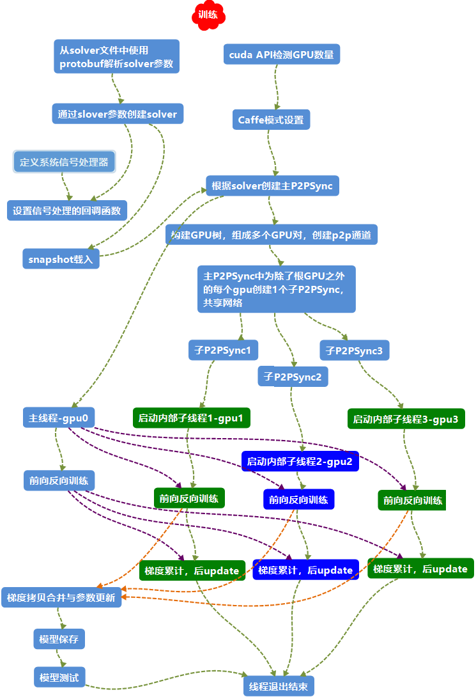

# nvcaffe架构
该nvcaffe架构低于0.17.4版本，因此该架构说明对于0.17.4版本的nvcaffe仅提供借鉴参考，不代表nvcaffe-0.17.4版本的架构


## 关键C++类的简介

整体主干是P2PSync > Solver > Net > Layer > Blob > SyncedMemory

* Caffe：贯穿整个caffe框架，跟线程绑定，负责设备模式设置、cublas句柄控制、随机数设置等。

* P2PSync：用于多GPU交互训练，在多个本地GPU之间使用map-reduce来同步数据。

* Solver：具体网络训练的最外层类，管理超参数、训练测试网络、loss、权重更新和训练模型的保存读取等。

* Net：管理所有算法层及其连接联系，组成一个网络整体，为一个有向无环图DAG。

* Layer：主要的计算单元，派生出各种具体的算法层。一般包含初始化、前向和反向计算。

* SolverParameter / NetParameter / LayerParameter：外接protobuf::Message，通过解析prototxt文件的参数来填充赋值，分别为Solver、Net和Layer提供关键的初始参数。

* Blob：对Solver、Net和Layer的最基本的计算和数据存取单元，一般的维度是（num, channels, height, width），内部会使用SyncedMemory进行内存管理。

* SyncedMemory：CPU和GPU的内存管理器，主要通过blob来对外提供支持。

* Filler：随机数填充器，用于为blob填充随机数据，随机的方式有若干种算法可选。

* InternalThread：内部线程，主要用于数据预取和多GPU交互等需要开子线程协助的地方。

* BasePrefetchingDataLayer：数据预取数据层，继承于InternalThread和BaseDataLayer（继承于Layer），利用双堵塞队列和多线程的方式从内存预取数据到显存。

##  nvcaffe多GPU训练流程图




## 源码流程分析
* 先从prototxt文件中通过第三方库protobuf读取solver的参数：

```c++
caffe::SolverParameter solver_param;
caffe::ReadSolverParamsFromTextFileOrDie(FLAGS_solver, &solver_param);

```
* 在GPU模式下，当检测到GPU时，获取每个GPU的信息，并将0号GPU设为主GPU：
```c++
get_gpus(&gpus);
if (gpus.size() == 0) {
...
} else {
...
#ifndef CPU_ONLY
    cudaDeviceProp device_prop;
    for (int i = 0; i < gpus.size(); ++i) {
      cudaGetDeviceProperties(&device_prop, gpus[i]);
      LOG(INFO) << "GPU " << gpus[i] << ": " << device_prop.name;
    }
#endif
    solver_param.set_device_id(gpus[0]);
    Caffe::SetDevice(gpus[0]);
    Caffe::set_mode(Caffe::GPU);
    Caffe::set_solver_count(gpus.size());
}
```

* 当使用的GPU个数大于1时，会使用P2PSync来管理，否则直接由solver训练：
```c++
if (gpus.size() > 1) {
caffe::P2PSync<float> sync(solver, NULL, solver->param());
sync.Run(gpus);
} else {
LOG(INFO) << "Starting Optimization";
solver->Solve();
}

```

* 多GPU下使用P2PSync管理训练，P2PSync会构建GPU树，并构建P2P通道：
```c++
template<typename Dtype>
P2PSync<Dtype>::P2PSync(shared_ptr<Solver<Dtype> > root_solver,
P2PSync<Dtype>* parent, const SolverParameter& param)
: GPUParams<Dtype>(root_solver, param.device_id()),
parent_(parent),
children_(),
queue_(),
initial_iter_(root_solver->iter()),
solver_() {
#ifndef CPU_ONLY
...
if (parent == NULL) {
solver_ = root_solver;
} else {
Caffe::set_root_solver(false);
solver_.reset(new WorkerSolver<Dtype>(param, root_solver.get()));
Caffe::set_root_solver(true);
}
this->configure(solver_.get());
solver_->add_callback(this);

if (parent) {
// Enable p2p access between devices
const int peer = parent->solver_->param().device_id();
int access;
CUDA_CHECK(cudaDeviceCanAccessPeer(&access, self, peer));
if (access) {
CUDA_CHECK(cudaDeviceEnablePeerAccess(peer, 0));
} else {
LOG(INFO)<< "GPU " << self << " does not have p2p access to GPU " << peer;
}
// Allocate receiving buffer on parent
...
}
CUDA_CHECK(cudaSetDevice(initial_device));
#else
NO_GPU;
#endif
}

```

* 为每一个子GPU创建一个P2PSync对象以共享网络:
```c++
template<typename Dtype>
void P2PSync<Dtype>::Run(const vector<int>& gpus) {
    vector<shared_ptr<P2PSync<Dtype> > > syncs(gpus.size());
    Prepare(gpus, &syncs);
    ...
}
```
* 为每个GPU的训练开启子线程，分别调度训练。而当前线程则去调主GPU去处理根solver的训练:
```c++
template<typename Dtype>
void P2PSync<Dtype>::Run(const vector<int>& gpus) {
    ...
    for (int i = 1; i < syncs.size(); ++i) {
    syncs[i]->StartInternalThread();
    }
    // Run root solver on current thread
    solver_->Solve();
    for (int i = 1; i < syncs.size(); ++i) {
    syncs[i]->StopInternalThread();
    }
}
// P2PSync的线程入口，调用被分配到solver进行训练
template<typename Dtype>
void P2PSync<Dtype>::InternalThreadEntry() {
...
solver_->Step(solver_->param().max_iter() - initial_iter_);
}

```
* 在每个线程进入到Solve()中即开始训练，每次迭代中在进入前向反向运算前，通过回调函数将训练网络参数同步到子GPU:
```c++
callbacks_[i]->on_start();
template<typename Dtype>
void P2PSync<Dtype>::on_start() {
...
// Wait for update from parent
if (parent_) {
P2PSync<Dtype> *parent = queue_.pop();
CHECK(parent == parent_);
}
// Update children
for (int i = children_.size() - 1; i >= 0; i--) {
Dtype* src = data_;
Dtype* dst = children_[i]->data_;
...
CUDA_CHECK(cudaMemcpyAsync(dst, src, size_ * sizeof(Dtype),
cudaMemcpyDeviceToDevice, cudaStreamDefault));
CUDA_CHECK(cudaStreamSynchronize(cudaStreamDefault));
children_[i]->queue_.push(this);
}
}
```
* 各个子GPU各自训练:
```c++
for (int i = 0; i < param_.iter_size(); ++i) {
loss += net_->ForwardBackward();
}
```
* 各子GPU训练结果即梯度汇总到主GPU:
```c++
callbacks_[i]->on_gradients_ready();

template<typename Dtype>
void P2PSync<Dtype>::on_gradients_ready() {
#ifndef CPU_ONLY
...
// Sum children gradients as they appear in the queue
for (int i = 0; i < children_.size(); ++i) {
P2PSync<Dtype> *child = queue_.pop();
Dtype* src = child->parent_grads_;
Dtype* dst = diff_;
...
caffe_gpu_add(size_, src, dst, dst);
}
// Send gradients to parent
if (parent_) {
Dtype* src = diff_;
Dtype* dst = parent_grads_;
...
CUDA_CHECK(cudaMemcpyAsync(dst, src, size_ * sizeof(Dtype),  //
cudaMemcpyDeviceToDevice, cudaStreamDefault));
CUDA_CHECK(cudaStreamSynchronize(cudaStreamDefault));
parent_->queue_.push(this);
} else {
// Loss functions divide gradients by the batch size, so to compensate
// for split batch, the root solver divides by number of solvers.
caffe_gpu_scal(size_, Dtype(1.0 / Caffe::solver_count()), diff_);
}
#endif
}
```
* 最后调用 ApplyUpdate() 更新网络参数。再进入下一次迭代。

## 三、多GPU交互训练的核心类P2PSync

P2PSync主要是在多个本地GPU之间使用map-reduce来同步数据，
该类继承于GPUParams和Solver的Callback。其中GPUParams是管理存放在GPU端的数据，
Callback使solver训练中可以用回调的方式来调用P2PSync相关函数来进行数据同步操作。
```c++
// 在本地gpu之间使用map-reduce同步数据并行
template<typename Dtype>
class P2PSync : public GPUParams<Dtype>, public Solver<Dtype>::Callback,
public InternalThread {
public:
explicit P2PSync(shared_ptr<Solver<Dtype> > root_solver,
P2PSync<Dtype>* parent, const SolverParameter& param);
...
// 运行，树的构建、开线程，开始训练
void Run(const vector<int>& gpus);
// 对GPU分组，并构建GPU树
void Prepare(const vector<int>& gpus,
vector<shared_ptr<P2PSync<Dtype> > >* syncs);
inline const int initial_iter() const { return initial_iter_; }

protected:
// 在solve中进行前向之前，用于同步网络参数给子GPU
void on_start();
// 将子GPU的梯度汇总到主GPU
void on_gradients_ready();
// 内部线程入口
void InternalThreadEntry();

P2PSync<Dtype>* parent_;
vector<P2PSync<Dtype>*> children_;
BlockingQueue<P2PSync<Dtype>*> queue_;
const int initial_iter_;
Dtype* parent_grads_;
shared_ptr<Solver<Dtype> > solver_;
// 网络参数和梯度是需要跨GPU更新同步的。
using Params<Dtype>::size_; // Size of buffers
using Params<Dtype>::data_; // Network parameters
using Params<Dtype>::diff_; // Gradient
};

```

## 参考链接
* 1 [nvcaffe架构图](https://raw.githubusercontent.com/cjmcv/deeplearning-paper-notes/master/images/pdDLF/caffe_s1_1.png)
* 2 [nvcaffe多GPU模式训练流程图](https://github.com/cjmcv/deeplearning-paper-notes/blob/master/images/pdDLF/caffe_s1_1.png)
* 3 [nvcaffe多GPU模式训练流程图](https://cjmcv.github.io/deeplearning-paper-notes/fcdlf/2017/05/01/Caffe_S1.html)
* 4 [分布式并行计算MapReduce](https://www.cnblogs.com/zyd1234/p/10966283.html)
