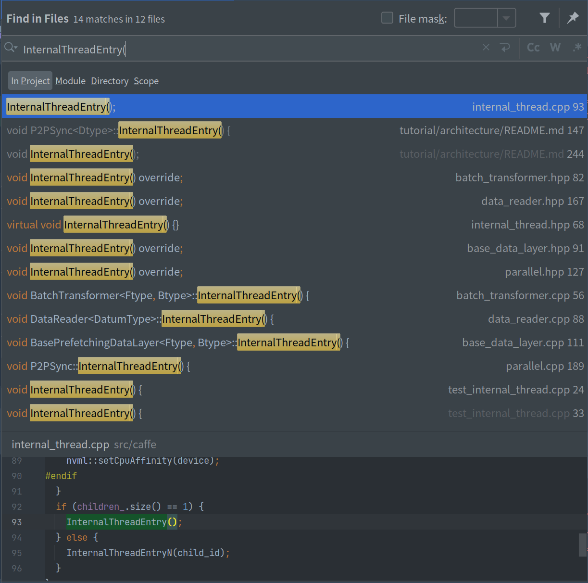

# internal_thread.hpp 代码解析
```text
Virtual class encapsulate boost::thread for use in base class
The child class will acquire the ability to run a single/multiple thread(s),
by reimplementing the virtual function InternalThreadEntry/InternalThreadEntryN.
```
* `InternalThread`类是一个虚类，子类继承`InternalThread`需要对虚函数
  `InternalThreadEntry/InternalThreadEntryN`进行重写，进而获得多线程的能力

## 继承`InternalThread`的子类
```text
batch_transformer.hpp
data_reader.hpp
base_data_layer.hpp
parallel.hpp
test_internal_thread.cpp
```


