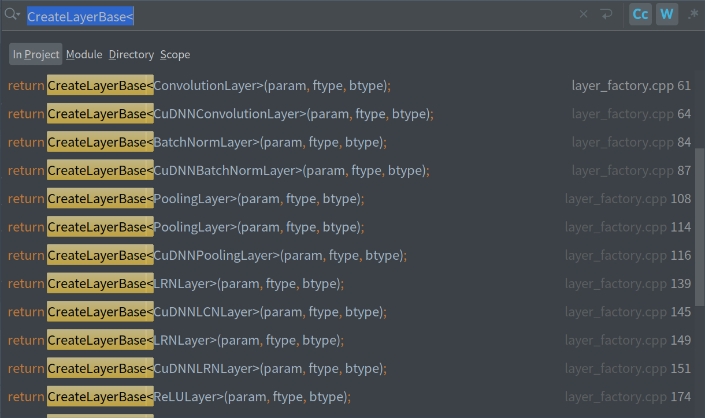

# layer_factory.hpp 代码解析
##  LayerRegisterer
* `LayerRegisterer`构造函数的参数`creator`是一个返回值为`shared_ptr<LayerBase>`函数参数为`(const LayerParameter&, Type, Type, size_t)`
的函数指针，`LayerRegisterer`调用了`LayerRegistry`类型的静态成员函数`AddCreator`，在同一个代码文件中，
类的非静态成员函数可以访问其他类的静态成员函数，静态成员函数只能访问静态成员变量。
```c++
class LayerRegisterer {
 public:
  LayerRegisterer(const string& type,
      shared_ptr<LayerBase> (*creator)(const LayerParameter&, Type, Type, size_t)) {
    LayerRegistry::AddCreator(type, creator);
  }
};
```
## `REGISTER_LAYER_CLASS(type)`宏定义
```c++
#define REGISTER_LAYER_CLASS(type)                                             \
  shared_ptr<LayerBase> Creator_##type##Layer(const LayerParameter& param,     \
      Type ftype, Type btype, size_t)                                          \
  {                                                                            \
    return CreateLayerBase<type##Layer>(param, ftype, btype);                  \
  }                                                                            \
  REGISTER_LAYER_CREATOR(type, Creator_##type##Layer)
```
* `REGISTER_LAYER_CLASS(type)`宏定义中定义了一个名为`Creator_##type##Layer`函数，函数体是执行
  `CreateLayerBase<type##Layer>(param, ftype, btype);`并返回其执行结果，
  
## 函数模板`CreateLayerBase()`
```c++
template<template <typename Ftype, typename Btype> class LType>
inline shared_ptr<LayerBase> CreateLayerBase(const LayerParameter& param,
    Type ftype, Type btype) {
  bool failed = false;
  shared_ptr<LayerBase> ptr;
  if (ftype == FLOAT) {
    if (btype == FLOAT) {
      ptr.reset(new LType<float, float>(param, solver_rank));
    } else if (btype == FLOAT16) {
      ptr.reset(new LType<float, float16>(param, solver_rank));
    } else if (btype == DOUBLE) {
      ptr.reset(new LType<float, double>(param, solver_rank));
    } else {
      failed = true;
    }
  }
  ...
  }
```
* `template <typename Ftype, typename Btype> class LType`作为模板的模板参数`LType`，
  通过向模板函数`CreateLayerBase()`传递`LType`类型的模板参数，`CreateLayerBase()`的调用语句如下：

```c++
template <typename Ftype, typename Btype>
class ConvolutionLayer : public BaseConvolutionLayer<Ftype, Btype> {
public:
```
* `CreateLayerBase<ConvolutionLayer>(param, ftype, btype)`接受的类模板参数是LType类型，
```c++
template <typename Ftype, typename Btype>
class BaseConvolutionLayer : public Layer<Ftype, Btype> {
 public:
```
* `BaseConvolutionLayer`类模板继承类模板`Layer<Ftype, Btype>`，
```c++
template<typename Ftype, typename Btype>
class Layer : public LayerBase {
 public:
```
* 类模板`Layer<Ftype, Btype>`则继承`LayerBase`类，
```c++
class LayerBase {
 public:
```
* 进一步解释了为什么在函数模板`CreateLayerBase()`中可以使用`ptr.reset(new LType<float, float>(param, solver_rank));`
这样的语句进行执行，虽然`LayerBase`不是模板类，但继承`LayerBase`的类都是接收`Layer<Ftype, Btype>`模板参数的类模板
  
## 注册完所有的`Layer`类型名以及所用到的函数指针

## 调用`LayerRegistry`类的静态成员函数`CreateLayer()`
```c++
static shared_ptr<LayerBase> CreateLayer(const LayerParameter& param, size_t solver_rank) {
    const string& layer_type = param.type();
    const string& layer_name = param.name();
    if (Caffe::root_solver()) {
      LOG(INFO) << "Creating layer '" << layer_name << "' of type '" << layer_type << "'";
    }
    CreatorRegistry& registry = Registry();
    CHECK_EQ(registry.count(layer_type), 1) << "Unknown layer type: '" << layer_type
        << "' (known types: " << LayerTypeListString() << ")";

    //  We compose these types in Net::Init
    Type ftype = param.forward_type();
    Type btype = param.backward_type();
    Type fmath = param.forward_math();
    Type bmath = param.backward_math();
    if (Caffe::root_solver()) {
      LOG(INFO) << "Layer's types are Ftype:" << Type_Name(ftype)
          << " Btype:" << Type_Name(btype)
          << " Fmath:" << Type_Name(fmath)
          << " Bmath:" << Type_Name(bmath);
    }
    return registry[layer_type](param, ftype, btype, solver_rank);
  }
```
* 调用`registry[layer_type](param, ftype, btype, solver_rank);`，
  `registry[layer_type]`是一个`typedef shared_ptr<LayerBase> (*Creator)(const LayerParameter&, Type, Type, size_t);`类型的函数指针
  
## 以`Data`为例梳理各种`Layer`创建流程


* [执行`LayerRegistry::CreateLayer()`静态成员函数](../../src/caffe/net.cpp#L202)->
  [`CreateLayer()`静态成员函数执行return registry[layer_type](param, ftype, btype, solver_rank);](./layer_factory.hpp#L189)->
  [`registry[layer_type]`是在宏定义中REGISTER_LAYER_CLASS_R(Data);已经注册](layer_factory.hpp#L240)
  
```c++
p layer_param.type()
$3 = "Data"
        
```
## 参考链接
* 1 [模板的模板参数](https://www.jianshu.com/p/c94184e295d7)
* 2 []()