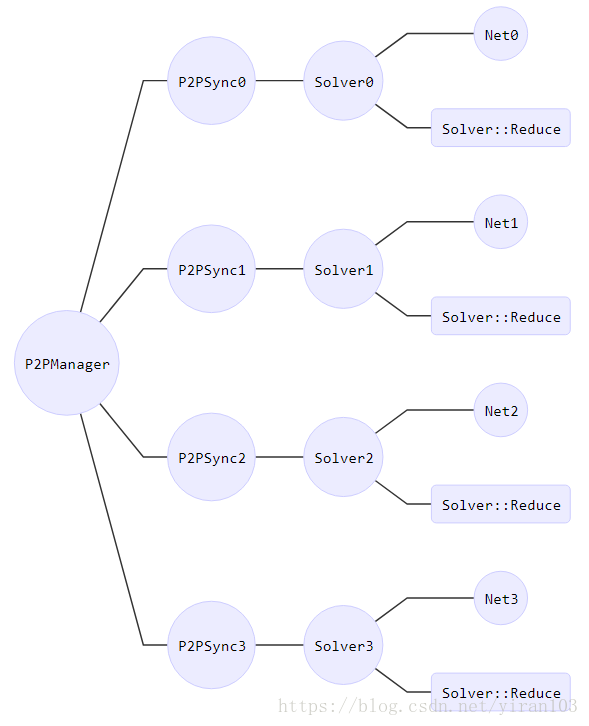
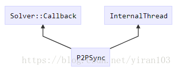

# parallel.hpp 代码解析
每个`Solver`会创建线程运行`Solver::Reduce`，而`Solver::Reduce`会借由`Net::ReduceAndUpdate`
调用`Net::Reduce`和`Solver::ApplyUpdate`，这意味着`Net::ForwardBackward`和`Net::ReduceAndUpdate`
会异步执行。

## `P2PManager`类
* `P2PSync`类使用了前向声明，`P2PManager`类声明了保护成员`vector<unique_ptr<P2PSync>> syncs_;`


  
## `P2PSync`类
* `P2PSync`类继承了`Solver::Callback`类以及`InternalThread`类，`P2PSync`拥有两个`Solver`指针，
  `solver_`和`root_solver_`
```c++
class P2PSync : public Solver::Callback, public InternalThread
protected:
shared_ptr<Solver> solver_, root_solver_;
```



* 需要对`InternalThread`类的虚函数`InternalThreadEntry()`
  进行重写`void P2PSync::InternalThreadEntry()`，调用流程如下：
```c++
  for (int i = 0; i < syncs_.size(); ++i) {
    syncs_[i]->StartInternalThread(true, static_cast<uint64_t>(param.random_seed() +
                                                               P2PManager::global_rank()));
  }
  for (int i = 0; i < syncs_.size(); ++i) {
    syncs_[i]->WaitAll();
  }
```
`StartInternalThread`是`InternalThread`类的内部函数，内部实现了通过开启`boost::thread`线程
来执行`InternalThread`类的`entry`函数，`entry`函数调用了子类实现的`InternalThreadEntry()`函数

## `solve_bar_`与`solved_bar_`
* `boost::barrier`是多线程的同步点，构造函数会要求传递一个数字，表示需要同步多少个线程。
  只有指定个数的线程到达这个点之后，程序才会继续往下走，否则会阻塞。
```c++
  static unique_ptr<boost::barrier> solve_bar_;
  static unique_ptr<boost::barrier> solved_bar_;
```


## 参考链接
* 1 [`P2PManager`类分析](https://blog.csdn.net/yiran103/article/details/81220278)
* 2 [`C++`前向声明](https://www.cnblogs.com/wkfvawl/p/10801725.html)
* 3 [`static constexp`使用](https://blog.csdn.net/mxyhktk/article/details/112016564)
