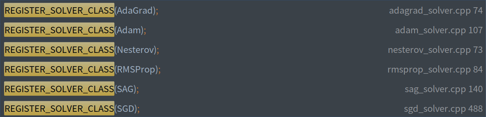

# solver_factory.hpp 代码解析
## 使用`typedef`定义返回值为`Solver*`，参数为`(const SolverParameter&, size_t, Solver*)`的函数指针类型Creator
```c++
typedef Solver* (*Creator)(const SolverParameter&, size_t, Solver*);
```
## 使用`typedef`定义`map`数据结构类型`CreatorRegistry`
```c++
typedef std::map<string, Creator> CreatorRegistry;
```

## `REGISTER_SOLVER_CREATOR`宏定义
* 宏定义`REGISTER_SOLVER_CREATOR`声明了`SolverRegisterer`类型的对象`g_creator_f_##type`，
  由于`g_creator_f_##type`是一个全局变量，因此程序执行在进入`main`函数之前会被定义
```c++
#define REGISTER_SOLVER_CREATOR(type, creator)                                 \
    static SolverRegisterer g_creator_f_##type(#type, creator)
```
宏定义`REGISTER_SOLVER_CREATOR(type, creator)`在宏定义`REGISTER_SOLVER_CLASS(type)`中被调用，
以参数`AdaDelta`举例说明
```c++
REGISTER_SOLVER_CLASS(AdaDelta);
```
## `REGISTER_SOLVER_CLASS(type)`宏定义
```c++
#define REGISTER_SOLVER_CLASS(type)                                            \
  Solver* Creator_##type##Solver(                                              \
      const SolverParameter& param,                                            \
      size_t rank,                                                             \
      Solver* root_solver)                                                     \
  {                                                                            \
    const Type tp = param.solver_data_type();                                  \
    switch (tp) {                                                              \
      case FLOAT:                                                              \
        return new type##Solver<float>(param, rank, root_solver);              \
        break;                                                                 \
      case FLOAT16:                                                            \
        return new type##Solver<float16>(param, rank, root_solver);            \
        break;                                                                 \
      case DOUBLE:                                                             \
        return new type##Solver<double>(param, rank, root_solver);             \
        break;                                                                 \
      default:                                                                 \
        LOG(FATAL) << "Solver data type " << Type_Name(tp)                     \
                   << " is not supported";                                     \
    }                                                                          \
    return nullptr;                                                            \
  }                                                                            \
  REGISTER_SOLVER_CREATOR(type, Creator_##type##Solver)
```
## 以`REGISTER_SOLVER_CLASS(AdaDelta)`语句执行举例说明
* 宏定义`REGISTER_SOLVER_CLASS(type)`首先定义了一个通过读取`param.solver_data_type()`参数对类模板`type##Solver`
  即`AdaDeltaSolver`进行初始化,并且返回值类型为`caffe::Solver *`的函数`Creator_##type##Solver`,
  通过传进来的参数`type`以及在`REGISTER_SOLVER_CLASS(type)`定义的函数`Creator_##type##Solver`
  作为宏定义`REGISTER_SOLVER_CREATOR(type, Creator_##type##Solver)`的参数使用， 
  此时`Creator_AdaDeltaSolver`是一个函数指针`(caffe::Solver *(*)(const caffe::SolverParameter &, size_t, caffe::Solver *)) 0x7faaf94837d8 <caffe::Creator_AdaDeltaSolver(caffe::SolverParameter const&, unsigned long, caffe::Solver*)>`
  以`REGISTER_SOLVER_CREATOR(AdaDelta, Creator_AdaDeltaSolver)`语句执行举例说明， 首先调用了`SolverRegisterer`构造函数，
  定义了`SolverRegisterer`类型的静态全局变量`g_creator_f_AdaDelta`，
  `SolverRegisterer`构造函数调用了`SolverRegistry`类型的静态成员函数`AddCreator()`，`AddCreator()`静态成员函数调用了
  `SolverRegistry`类型的静态成员函数`Registry()`，`Registry()`静态成员函数定义了一个`CreatorRegistry`类型的静态局部变量
  `g_registry_`并返回赋值给静态成员函数`AddCreator()`中定义的`CreatorRegistry&`类型的`registry`变量，
  `CreatorRegistry`类型是使用`typedef`关键字定义的`std::map<string, Creator>`数据结构类型，
  程序执行到静态变量的定义时只初始化一次，
  上述代码总结：`SolverRegisterer`类型的静态全局变量`g_creator_f_AdaDelta`通过构造函数`SolverRegisterer`调用
  `SolverRegistry::AddCreator(AdaDelta, Creator_AdaDeltaSolver);`把`AdaDelta`类型的函数指针`Creator_AdaDeltaSolver`
  添加到如下定义的字典静态变量`g_registry_`中,当`g_registry_`通过关键字`AdaDelta`即可调用函数指针`Creator_AdaDeltaSolver`
```c++
  typedef Solver* (*Creator)(const SolverParameter&, size_t, Solver*);
  typedef std::map<string, Creator> CreatorRegistry;
```


## 接下来按照同样的逻辑执行`REGISTER_SOLVER_CREATOR()`代码

