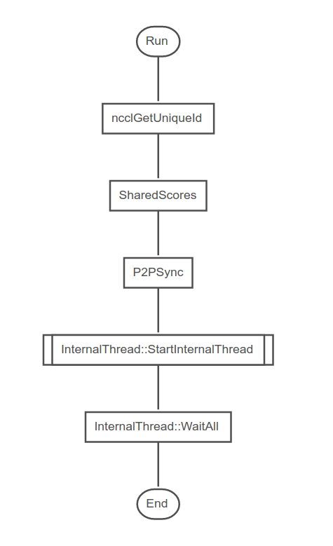
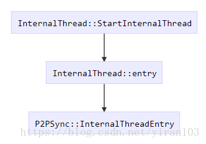

# parallel.cpp 代码解析

## 构造函数`P2PManager::P2PManager`
* 多卡训练需要`NCCL`，检查数量是否一致。
  `ncclGetUniqueId`函数生成要在`ncclCommInitRank`函数中使用的`nccl_id_`，
  应该调用一次`ncclGetUniqueId`函数。在调用`ncclCommInitRank`函数之前，应将`nccl_id_`分发给通信器中的所有队列。
```c++
#ifndef USE_NCCL
  LOG(FATAL) << "USE_NCCL must be specified for multi-GPU mode";
#else
  LOG_IF(FATAL, CAFFE_NCCL_VER < 20200) << "NCCL 2.2 or higher is required";
  if (global_rank_ == 0) {
    NCCL_CHECK(ncclGetUniqueId(&nccl_id_));
  }
#endif
#ifdef USE_MPI
  MPI_Bcast(&nccl_id_, sizeof(nccl_id_), MPI_BYTE, 0, MPI_COMM_WORLD);
#endif
```

## `void P2PManager::Run(const vector<int>& gpus)`函数

* 读取求解器参数，切换设备`nccl_id_`后用于初始化多个`P2PSync`类对象。
  每个`P2PSync`类对象`syncs_[i]`的`shared_`均指向`P2PManager`创建出的共享内存。
```c++
shared_ptr<SharedScores<float>> shared_
```
```c++
  SolverParameter param = root_solver_->param();
  this->shared_ = make_shared<SharedScores<float>>(nranks_);
  for (int i = 0; i < gpus.size(); ++i) {
    param.set_device_id(gpus[i]);
    const int universal_rank = (int)gpus.size() * P2PManager::global_rank() + i;
    LOG(INFO) << "Starting sync " << i << " (of total " << gpus.size() << "), {"
              << universal_rank << "." << universal_rank_count << "}";
    syncs_[i].reset(new P2PSync(this, root_solver_, universal_rank, universal_rank_count, param));
    syncs_[i]->shared_ = this->shared_;
  }
```
* 每个`P2PSync`类对象`syncs_[i]`启动线程，`StartInternalThread`触发了`P2PSync::InternalThreadEntry`，
并等待线程完成，最后再通过`Solver::perf_report(std::ostream& os, int device, int align)`输出性能报告
```c++
  LOG(INFO) << "Starting Optimization";

  for (int i = 0; i < syncs_.size(); ++i) {
    syncs_[i]->StartInternalThread(true, static_cast<uint64_t>(param.random_seed() +
                                                               P2PManager::global_rank()));
  }
  for (int i = 0; i < syncs_.size(); ++i) {
    syncs_[i]->WaitAll();
  }

```


## 参考链接
* 1 [`P2PManager`类分析](https://blog.csdn.net/yiran103/article/details/81220278)