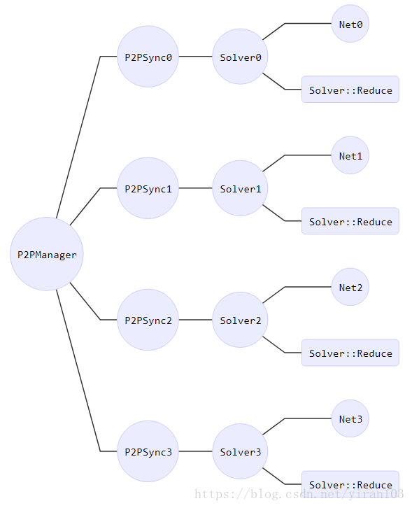

# solver.cpp 代码解析

## `Solver::GetRequestedAction()`函数
```c++
SolverAction::Enum Solver::GetRequestedAction() {
  if (action_request_function_) {
    // If the external request function has been set, call it.
    return action_request_function_();
  }
  return SolverAction::NONE;
}
```
`action_request_function_`函数指针对象是通过如下代码赋值的
```c++
void Solver::SetActionFunction(ActionCallback func) {
  action_request_function_ = func;
}
```

## `Step`函数


* 每个`Solver`会创建线程运行`Solver::Reduce`，而`Solver::Reduce`会借由`Net::ReduceAndUpdate`
  调用`Net::Reduce`和`Solver::ApplyUpdate`，这意味着`Net::ForwardBackward`和`Net::ReduceAndUpdate`
  会异步执行。