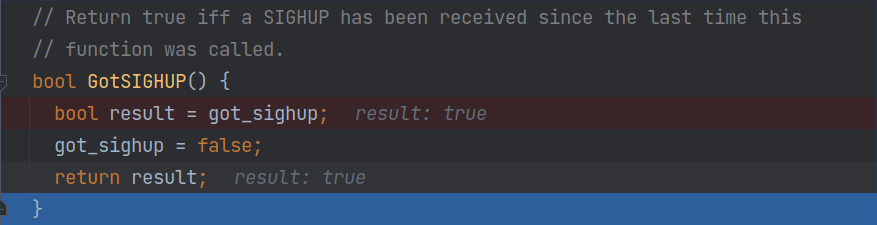

# signal_handler.cpp 代码解析

## 信号的基础知识
```shell
./cmake-build-debug/tools/caffe-d train --solver=examples/cifar10/cifar10_quick_solver.prototxt
```
* 使用`ctrl+c`直接终止程序执行
* 使用`ctrl+z`将`caffe-d`进程程序挂起(进程程序暂停执行)，`fg`命令可以将进程`caffe-d`继续在前台执行，
  `bg`命令可以将进程`caffe-d`在后台继续执行，使用`jobs`命令可以查看被挂起的进程，`kill %id`将终止被挂起的进程id

## sigaction结构体
```c++
    struct sigaction sa;
    // Setup the handler,初始化sigaction结构体类型
    sa.sa_handler = &handle_signal;
    // Restart the system call, if at all possible，指定信号处理函数
    sa.sa_flags = SA_RESTART;
    // Block every signal during the handler，如果信号中断了某个指令的调用，当信号处理函数执行完毕之后将继续执行该指令
    sigfillset(&sa.sa_mask);
    // Intercept SIGHUP and SIGINT，指定需要阻塞的信号，即把当前的信号处理函数执行完毕后再处理新的信号
    if (sigaction(SIGHUP, &sa, NULL) == -1) {
      LOG(FATAL) << "Cannot install SIGHUP handler.";
    }
    if (sigaction(SIGINT, &sa, NULL) == -1) {
      LOG(FATAL) << "Cannot install SIGINT handler.";
    }
  /*
   * 返回值：若成功则返回0，若出错则返回-1
   * act指针非空, 则修改信号的动作;
   * oact指针非空, 则返回该信号的上一个动作.
   */
```
  
## boost::bind使用
* `boost::bind` 绑定成员函数
```c++
// Return the function that the solver can use to find out if a snapshot or
// early exit is being requested.
ActionCallback SignalHandler::GetActionFunction() const {
return boost::bind(&SignalHandler::CheckForSignals, this);
}
```
## `CheckForSignals`函数
* `CheckForSignals`负责把接收到的信号与设置的默认操作一一对应起来，如果没有信号发送过来，则返回`SolverAction::NONE`

```c++
SolverAction::Enum SignalHandler::CheckForSignals() const {
  if (GotSIGHUP()) {
    return SIGHUP_action_;// 当接收到`SIGHUP`信号时，返回`STOP`、`SNAPSHOT`、`NONE`其中的一种操作
  }
  if (GotSIGINT()) {
    return SIGINT_action_;// 当接收到`SIGINT`信号时，返回`STOP`、`SNAPSHOT`、`NONE`其中的一种操作
  }
  return SolverAction::NONE;
}
```


## `GotSIGHUP`与`GotSIGINT`函数
```c++
static volatile sig_atomic_t got_sigint = false;
static volatile sig_atomic_t got_sighup = false;
static bool already_hooked_up = false;

// 负责把接收到的`int`类型的信号`signal`传递给`sig_atomic_t`类型的对象`got_sigint`、`got_sighup`
void handle_signal(int signal) {
switch (signal) {
    case SIGHUP:
    got_sighup = true;
    break;
    case SIGINT:
    got_sigint = true;
    break;
    }
}
    
  // Return true if a SIGINT has been received since the last time this
  // function was called.
  bool GotSIGINT() {
    bool result = got_sigint;
    got_sigint = false; //
    return result;
  }

  // Return true iff a SIGHUP has been received since the last time this
  // function was called.
  bool GotSIGHUP() {
    bool result = got_sighup;
    got_sighup = false; // 如果接收`SIGHUP`信号的默认操作是`SNAPSHOT`，把参数`got_sighup`设置为`false`，
                        // 可以避免每次迭代都要对模型参数进行保存操作
    return result;
  }
}  // namespace
```


```shell
./cmake-build-debug/tools/caffe-d train \
--solver=examples/cifar10/cifar10_quick_solver.prototxt \
--sighup_effect=snapshot --sigint_effect=snapshot
```
`caffe-d`进程从其他终端获取`SIGHUP`信号，



## 参考链接
* 1 [boost::bind使用教程](https://www.boost.org/doc/libs/1_66_0/libs/bind/doc/html/bind.html)
* 2 [SignalHandler代码解析](https://alanse7en.github.io/caffedai-ma-jie-xi-4/)
* 3 [信号的概念](https://www.freecplus.net/eec5c39aa63b45ad946f1cc08134d9f9.html)
* 4 [进程的终止和挂起命令详解](https://www.cnblogs.com/machangwei-8/p/10391440.html)
* 5 [不具名的命名空间相当于声明一个局部作用域](https://www.cnblogs.com/wkfvawl/p/10500594.html)
* 6 [boost::bind绑定成员函数](https://www.cnblogs.com/blueoverflow/p/4740093.html)
* 7 [信号sigaction视频详解](https://www.bilibili.com/video/BV145411a76x?p=6)
* 8 [信号sigaction详解](http://zyan.cc/book/linux_c/html/ch33s04.html)


