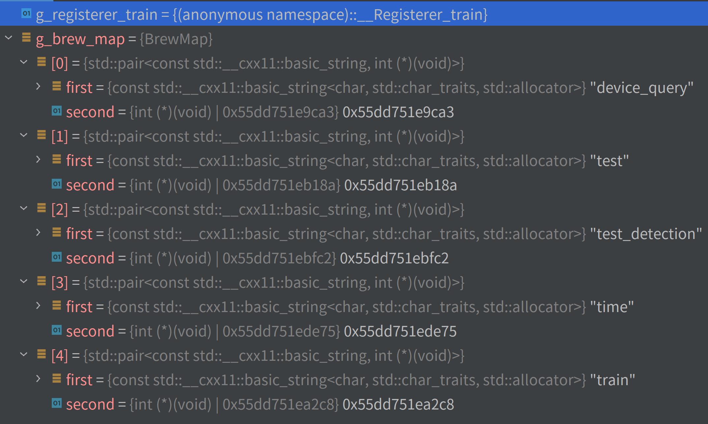

# caffe.cpp源码分析

## `caffe`命令行参数解析
```c++
DEFINE_string(sigint_effect, "stop",
             "Optional; action to take when a SIGINT signal is received: "
              "snapshot, stop or none.");
DEFINE_string(sighup_effect, "snapshot",
             "Optional; action to take when a SIGHUP signal is received: "
             "snapshot, stop or none.");
```
```c++
caffe::SignalHandler signal_handler(
        GetRequestedAction(FLAGS_sigint_effect),
        GetRequestedAction(FLAGS_sighup_effect));
```
* `SignalHandler`类对象`signal_handler`从命令行参数中获取到信号参数`FLAGS_sigint_effect`,`FLAGS_sighup_effect`
* `sigint_effect`默认值为`stop`，即`caffe.bin`进程当遇到`ctrl+c`信号时将终止进程继续执行
* `sighup_effect`默认值为`snapshot`，即`caffe.bin`进程当遇到`ctrl+z`信号时将被挂起，
  可以执行`fg`命令使得被挂起的`caffe.bin`进程继续执行
* `sigint_effect`和`sighup_effect`的值都被设置为`none`，即`caffe.bin`进程执行不会受到信号`ctrl+c`以及`ctrl+z`的影响

* `caffe`设置了两种信号`SIGHUP`、`SIGINT`的处理响应机制，分别为`stop`(进程终止)、`snapshot`(进程挂起)、
  `none`(进程执行不受信号干扰)， 并对其他的信号处理进行了屏蔽操作

## nvcaffe关于layer初始化流程如下：  
  
[调试断点设置在`layer_factory.hpp`中的`return registry[layer_type](param, ftype, btype, solver_rank);`处](../include/caffe/layer_factory.hpp#L189)

  
## 首先从主函数main()开始
1. main()函数
```c++
FLAGS_alsologtostderr = 1; //参考3,4
```
调用了`DECLARE_bool(alsologtostderr);`定义了一个flB命名空间下的bool变量FLAGS_alsologtostderr,并对其赋值为true
意思是:
```c++
FLAGS_alsologtostderr = 1;  //设置日志消息除了日志文件之外是否去标准输出
```
## Properties类
* 通过Properties获取caffe、cudnn、cublas、cuda软件版本以及nvidia-gpu设备信息
```c++
Caffe::Properties& props = Caffe::props();
```
## Py_InitializeEx
* 这段代码没看懂，需要跟进
```c++
#ifdef WITH_PYTHON_LAYER
    try {
      Py_InitializeEx(0);
      if (!PyEval_ThreadsInitialized()) {
        PyEval_InitThreads();
        static PyThreadState* mainPyThread = PyEval_SaveThread();
        (void)mainPyThread;
      }
#endif
```
## BrewFunction函数指针
* 使用`typedef`定义一个名为BrewFunction函数指针类型，返回一个指向int类型的指针
```c++
typedef int (*BrewFunction)();
```
## BrewMap
* 使用`typedef`定义一个map类型的数据结构`BrewMap`
```c++
typedef std::map<std::string, BrewFunction> BrewMap;
```

## GetBrewFunction() 函数
* GetBrewFunction() 函数返回 g_brew_map[name], 即返回需要实现功能的函数
```c++
static BrewFunction GetBrewFunction(const string& name) {
  if (g_brew_map.count(name)) {
    return g_brew_map[name];
  } else {
    LOG(ERROR) << "Available caffe actions:";
    for (BrewMap::iterator it = g_brew_map.begin();
         it != g_brew_map.end(); ++it) {
      LOG(ERROR) << "\t" << it->first;
    }
    LOG(FATAL) << "Unknown action: " << name;
    return NULL;  // not reachable, just to suppress old compiler warnings.
  }
}
```
## RegisterBrewFunction 宏定义
```c++
// 参考1，2
#define RegisterBrewFunction(func) \
namespace { \
class __Registerer_##func { \
 public: /* NOLINT */ \
  __Registerer_##func() { \
    g_brew_map[#func] = &func; \
  } \
}; \
__Registerer_##func g_registerer_##func; \
}
```
* 通过`RegisterBrewFunction`宏定义声明了`__Registerer_##func`类型，
并基于此类实例化了`g_registerer_##func`对象，
该类型的构造函数把函数指针类型的`func`添加到全局变量
g_brew_map的值中，
* 执行如下代码，
```c++
RegisterBrewFunction(device_query);
RegisterBrewFunction(train);
RegisterBrewFunction(test);
RegisterBrewFunction(test_detection);
RegisterBrewFunction(time);
```


## ReadSolverParamsFromTextFileOrDie
* 从参数`FLAGS_solver`中读取网络训练所需的配置的文件并返回一个`SolverParameter`类型的对象solver_param
```c++
caffe::SolverParameter solver_param = caffe::ReadSolverParamsFromTextFileOrDie(FLAGS_solver);
```
## 添加网络训练阶段信息
```c++
solver_param.mutable_train_state()->set_level(FLAGS_level);
  for (int i = 0; i < stages.size(); i++) {
    solver_param.mutable_train_state()->add_stage(stages[i]);//protobuf的mutable_以及add_方法参考7
    // 调用mutable_方法可以对train_state中的stage进行修改
  }
```
* proto文件中的SolverParameter类信息
```c++
message SolverParameter {
    // The states for the train/test nets. Must be unspecified or
    // specified once per net.
    //
    // By default, all states will have solver = true;
    // train_state will have phase = TRAIN,
    // and all test_state's will have phase = TEST.
    // Other defaults are set according to the NetState defaults.
    optional NetState train_state = 26;
    repeated NetState test_state = 27;
}
enum Phase {
   TRAIN = 0;
   TEST = 1;
}

message NetState {
  optional Phase phase = 1 [default = TEST];
  optional int32 level = 2 [default = 0];
  repeated string stage = 3;
}
```
## 设置GPU参数
* 从输入参数FLAGS_gpu中解析并设置被调用的GPU设备参数，
```c++
// Parse GPU ids or use all available devices
static void get_gpus(vector<int>* gpus) {
  if (FLAGS_gpu == "all") {
    const int count = Caffe::device_count();
    for (int i = 0; i < count; ++i) {
      gpus->push_back(i);
    }
  } else if (FLAGS_gpu.size()) {
    vector<string> strings;
    boost::split(strings, FLAGS_gpu, boost::is_any_of(", "));
    for (int i = 0; i < strings.size(); ++i) {
      gpus->push_back(boost::lexical_cast<int>(strings[i]));
    }
  } else {
    CHECK_EQ(gpus->size(), 0);
  }
}
```
## 读取GPU设备属性
```c++
cudaDeviceProp device_prop;
    for (int i = 0; i < gpus.size(); ++i) {
      cudaGetDeviceProperties(&device_prop, gpus[i]);
      LOG(INFO) << "GPU " << gpus[i] << ": " << device_prop.name;
    }
```
* gdb中执行`p device_prop`命令显示如下：
<details><summary>展开/收起</summary>
<pre><code>
$26 = {name = {78 'N', 86 'V', 73 'I', 68 'D', 73 'I', 65 'A', 32 ' ', 71 'G', 101 'e', 70 'F', 111 'o', 114 'r', 99 'c', 101 'e', 32 ' ', 71 'G', 84 'T', 88 'X', 32 ' ', 49 '1', 54 '6', 54 '6', 48 '0', 32 ' ', 83 'S', 85 'U', 80 'P', 69 'E', 82 'R', }, 
       luidDeviceNodeMask = 0, totalGlobalMem = 6232997888, sharedMemPerBlock = 49152, regsPerBlock = 65536, warpSize = 32, 
       memPitch = 2147483647, maxThreadsPerBlock = 1024, maxThreadsDim = {1024, 1024, 64}, 
       maxGridSize = {2147483647, 65535, 65535}, clockRate = 1785000, totalConstMem = 65536, major = 7, minor = 5, 
       textureAlignment = 512, texturePitchAlignment = 32, deviceOverlap = 1, multiProcessorCount = 22, 
       kernelExecTimeoutEnabled = 1, integrated = 0, canMapHostMemory = 1, computeMode = 0, maxTexture1D = 131072, 
       maxTexture1DMipmap = 32768, maxTexture1DLinear = 268435456, maxTexture2D = {131072, 65536}, 
       maxTexture2DMipmap = {32768, 32768}, maxTexture2DLinear = {131072, 65000, 2097120}, 
       maxTexture2DGather = {32768, 32768}, maxTexture3D = {16384, 16384, 16384}, maxTexture3DAlt = {8192, 8192, 32768}, 
       maxTextureCubemap = 32768, maxTexture1DLayered = {32768, 2048}, maxTexture2DLayered = {32768, 32768, 2048}, 
       maxTextureCubemapLayered = {32768, 2046}, maxSurface1D = 32768, maxSurface2D = {131072, 65536}, 
       maxSurface3D = {16384, 16384, 16384}, maxSurface1DLayered = {32768, 2048}, maxSurface2DLayered = {32768, 32768, 2048}, 
       maxSurfaceCubemap = 32768, maxSurfaceCubemapLayered = {32768, 2046}, surfaceAlignment = 512, concurrentKernels = 1, 
       ECCEnabled = 0, pciBusID = 1, pciDeviceID = 0, pciDomainID = 0, tccDriver = 0, asyncEngineCount = 3, 
       unifiedAddressing = 1, memoryClockRate = 7001000, memoryBusWidth = 192, l2CacheSize = 1572864, 
       persistingL2CacheMaxSize = 0, maxThreadsPerMultiProcessor = 1024, streamPrioritiesSupported = 1, 
       globalL1CacheSupported = 1, localL1CacheSupported = 1, sharedMemPerMultiprocessor = 65536, 
       regsPerMultiprocessor = 65536, managedMemory = 1, isMultiGpuBoard = 0, multiGpuBoardGroupID = 0, 
       hostNativeAtomicSupported = 0, singleToDoublePrecisionPerfRatio = 32, pageableMemoryAccess = 0, 
       concurrentManagedAccess = 1, computePreemptionSupported = 1, canUseHostPointerForRegisteredMem = 1, 
       cooperativeLaunch = 1, cooperativeMultiDeviceLaunch = 1, sharedMemPerBlockOptin = 65536, 
       pageableMemoryAccessUsesHostPageTables = 0, directManagedMemAccessFromHost = 0, maxBlocksPerMultiProcessor = 16, 
       accessPolicyMaxWindowSize = 0, reservedSharedMemPerBlock = 0}
</code></pre>
</details>  

## cuda绑定GPU设备
```c++
Caffe::SetDevice(gpus[0]);

void Caffe::SetDevice(const int device_id) {
  root_device_ = device_id;
  CUDA_CHECK(cudaSetDevice(root_device_));
}
```

## 参考链接
* 1 [nvcaffe代码解读](https://blog.csdn.net/s_sunnyy/category_6381314.html)
* 2 [nvcaffe代码解读](https://blog.csdn.net/s_sunnyy/article/details/78247827)
* 3 [用于控制链接库总函数对外是否可见](https://blog.csdn.net/mutourenzhang/article/details/47803803)
* 4 [glog日志输出](https://www.cnblogs.com/hiloves/p/6009707.html)
* 5 [gdb调试指南](https://blog.csdn.net/taolusi/article/details/81074117)
* 6 [glog关于`<<`运算符的重载](https://www.cnblogs.com/zhoug2020/p/5884598.html)
* 7 [protobuf关于mutable_属性方法的调用](https://blog.csdn.net/liuxiao723846/article/details/105564742)